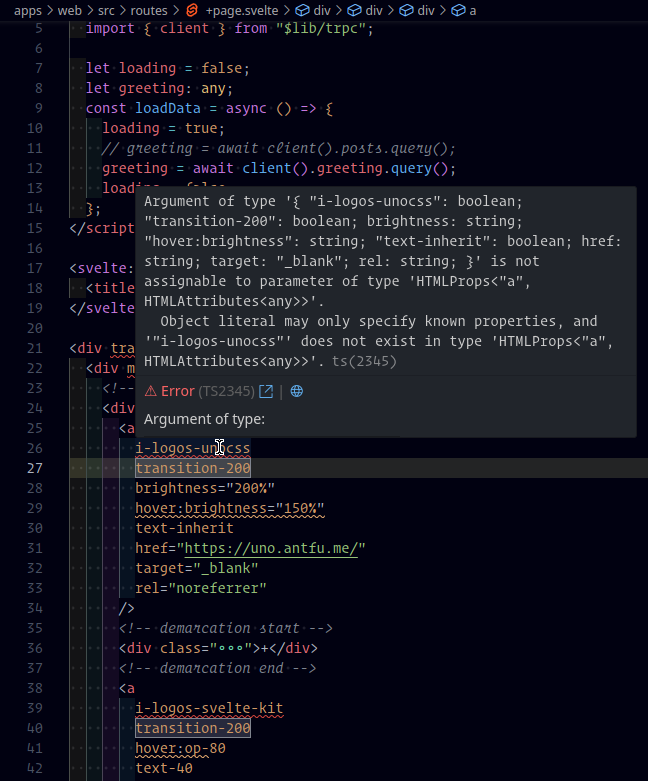

# NOTES

## TLDR

```shell
$ pnpm build
# web
$ pnpm preview
# server
$ pnpm start:server
```

## Important use node version v18.16.0 else server crash with [ERR_UNKNOWN_FILE_EXTENSION]

```shell
$ node -v
v20.2.0

$ pnpm dev
@apps/server:dev: TypeError [ERR_UNKNOWN_FILE_EXTENSION]: Unknown file extension ".mts" for /mnt/storage/Development/Svelte/SvelteKit/SvelteKitPayloadCMSTRPCTurborepo/sk-trpc-payload/apps/server/src/server.mts

$ nvm use v18.16.0
Now using node v18.16.0 (npm v9.5.1)

$ pnpm dev
...
@apps/web:dev:   VITE v4.3.9  ready in 1241 ms
@apps/web:dev: 
@apps/web:dev:   ➜  Local:   http://localhost:5173/
@apps/web:dev:   ➜  Network: http://192.168.1.105:5173/
@apps/web:dev:   ➜  Network: http://172.20.0.1:5173/
@apps/web:dev:   ➜  Network: http://192.168.96.1:5173/
@apps/web:dev:   ➜  Network: http://172.26.0.1:5173/
@apps/web:dev:   ➜  Network: http://172.18.0.1:5173/
@apps/server:dev: [20:41:29] INFO (payload): Connected to MongoDB server successfully!
@apps/server:dev: [20:41:29] INFO (payload): Starting Payload...
@apps/server:dev: [20:41:30] INFO (payload): Payload Admin URL: http://192.168.1.105:3000/admin
@apps/server:dev: API Server listening on port 3000
```

## Build

```shell
$ pnpm build
...
@apps/server:build: Error: Cannot find module './collections/Categories.cjs'
@apps/server:build: Require stack:
@apps/server:build: - /mnt/storage/Development/Svelte/SvelteKit/@sk-trpc-payload/apps/server/src/payload.config.ts
```

remove `.cjs` before build, but it will appear after build again

`apps/server/src/payload.config.ts`

``ts
import Categories from "./collections/Categories";
import Posts from "./collections/Posts";
import Tags from "./collections/Tags";
import Users from "./collections/Users";
import Customers from "./collections/Customers";
``

to fix remove `--file ./src/payload.config.ts 's";' 's.cjs";' \` from `apps/server/scripts/build.sh`

```shell
rm -rf dist
./scripts/rail/replacer \
  --dirfile ./src 'access";' 'access.cjs";' \
  --file ./src/server.mts handler.mjs handler.js \
  --file ./package.json '"type":' '"#type":' # mod-off
node esbuild.build.mjs

# removed
#  --file ./src/payload.config.ts 's";' 's.cjs";' \
```

```shell
$ pnpm start:server

@apps/server:start: Error [ERR_MODULE_NOT_FOUND]: Cannot find module '/mnt/storage/Development/Svelte/SvelteKit/@sk-trpc-payload/apps/server/dist/trpc/router.mts' imported from /mnt/storage/Development/Svelte/SvelteKit/@sk-trpc-payload/apps/server/dist/server.mjs
```

fix adding `.cjs` to `apps/server/dist/payload.config.cjs`

ex

```js
var import_Categories = __toESM(require("./collections/Categories"));
var import_Posts = __toESM(require("./collections/Posts"));
var import_Tags = __toESM(require("./collections/Tags"));
var import_Users = __toESM(require("./collections/Users"));
var import_Customers = __toESM(require("./collections/Customers"));
```

to

```js
var import_Categories = __toESM(require("./collections/Categories.cjs"));
var import_Posts = __toESM(require("./collections/Posts.cjs"));
var import_Tags = __toESM(require("./collections/Tags.cjs"));
var import_Users = __toESM(require("./collections/Users.cjs"));
var import_Customers = __toESM(require("./collections/Customers.cjs"));
```

final fix is adding **replaces after build** to `apps/server/scripts/build.sh`

do the same for

```shell
@apps/server:start: Error [ERR_MODULE_NOT_FOUND]: Cannot find module '/mnt/storage/Development/Svelte/SvelteKit/@sk-trpc-payload/apps/server/dist/trpc/router.mts' imported from /mnt/storage/Development/Svelte/SvelteKit/@sk-trpc-payload/apps/server/dist/server.mjs
```

```shell
# replaces after build
./scripts/rail/replacer \
  --file ./dist/payload.config.cjs 's"));' 's.cjs"));' \
  --file ./dist/server.mjs '.mts' '.mjs'
```

## Fix firefox "Error: Not found: /service-worker.js"

- [Getting error 404 for `/service-worker.js` since 1.0.0-next.207 · Issue #3159 · sveltejs/kit](https://github.com/sveltejs/kit/issues/3159)

fix with 

```shell
$ cd apps/web
$ rm -rf build .svelte-kit && touch src/service-worker.js && npm run build && npm run preview
```

or in root create a blank file

```shell
$ touch apps/web/src/service-worker.js
```

## Fix: 17.32 error An unexpected error occurred: "https://registry.yarnpkg.com/@packages%2fdum: Not found".

- [An unexpected error occurred: &quot;https://registry.yarnpkg.com/&lt;package&gt;: Not found&quot; · Issue #5865 · yarnpkg/yarn](https://github.com/yarnpkg/yarn/issues/5865)

`apps/server/Dockerfile`

seems that is related to `dum` package

remove from `apps/server/package.json`

```json
{
  "devDependenciesRemoved": {
    "@packages/dum": "workspace:*",
    "@packages/replacer": "workspace:*"
  }
}
```

## Fix: "cors" does not match any of the allowed types

```shell
1.544 $ cross-env PAYLOAD_CONFIG_PATH=src/payload.config.ts payload build
2.965 [23:26:49] ERROR (payload): There were 1 errors validating your Payload config
2.965 [23:26:49] ERROR (payload): 1: "cors" does not match any of the allowed types
3.008 error Command failed with exit code 1.
```

seems that this occur because we build it in apps/server and not in root, and it need to access `.env` from root

## TurboPack and Docker

```shell
$  DOCKER_BUILDKIT=1 docker-compose -f docker-compose.yml build

 => [web builder 5/6] COPY . .                                                                                      6.6s
 => ERROR [web builder 6/6] RUN turbo prune --scope=web --docker                                                    0.4s
------
 > [web builder 6/6] RUN turbo prune --scope=web --docker:
```

this is related to `apps/web/package.json` name `"name": "@apps/web"`, we need to use `--scope=@apps/web` and not `--scope=web` else it will not found scope

## Copy with Symbolic links Failed

```shell
 => ERROR [web installer 10/12] COPY --from=builder /app/out/full/ .                                                0.1s
------
 > [web installer 10/12] COPY --from=builder /app/out/full/ .:
------
failed to solve: cannot copy to non-directory: /mnt/storage/var/lib/docker/overlay2/r4nv2ti6u8icvu2f99c9ilrv1/merged/app/apps/server/node_modules/@trpc/client
```

```shell
$ ls apps/server/node_modules/@trpc/ -la
total 16
drwxr-xr-x 2 mario users 4096 jul 25 23:32 .
drwxr-xr-x 6 mario users 4096 jul 25 23:32 ..
lrwxrwxrwx 1 mario users   98 jul 25 23:32 client -> ../../../../node_modules/.pnpm/@trpc+client@10.35.0_@trpc+server@10.35.0/node_modules/@trpc/client
lrwxrwxrwx 1 mario users   77 jul 25 23:32 server -> ../../../../node_modules/.pnpm/@trpc+server@10.35.0/node_modules/@trpc/server
```

- [Turborepo &#43; PNPM &#43; Remixで構成されたアプリケーションをFly.ioにデプロイする](https://polidog.jp/2023/05/02/flyio-turborepo-pnpm-remix/)

fix: add `**/node_modules` to root `.dockerignore`

## Fix PayloadCMS open in Browser fails `Cannot GET /` and `Cannot GET /admin`

works with above

FUCK ABOVE command used `payloadcms` image generated from payloadcms project, and not the docker -compose.yml `docker.io/library/sktrpcpayloadcms-server` image

```shell
# enter shell
$ docker run -it -p 3000:3000 -e MONGODB_URI=mongodb://172.17.0.1:27017/pcms -e PAYLOAD_SECRET=29c9b6d28297c5ede04f486a payloadcms sh

$ echo $PAYLOAD_CONFIG_PATH
dist/payload.config.js

$ echo $MONGO_URL
# empty no value

# run in workdir /home/node/app
$ node dist/server.js
[22:47:27] INFO (payload): Connected to MongoDB server successfully!
[22:47:27] INFO (payload): Starting Payload...
[22:47:28] INFO (payload): Payload Admin URL: http://localhost:3000/admin
```

THE REAL MAGIC that put this working at last

`RUN sed -i -- "s/#type/type/g" package.json`

enable development to see errors

```shell
/app # NODE_ENV="development"
/app # node apps/server/dist/server.mjs
[23:24:04] INFO (payload): Connected to MongoDB server successfully!
[23:24:04] INFO (payload): Starting Payload...
[23:24:05] INFO (payload): Payload Admin URL: /admin
API Server listening on port 3000
<i> [webpack-dev-middleware] wait until bundle finished: /index.html
webpack built cb8127ea89a38a9d98b6 in 11407ms
ERROR in main
Module not found: Error: Can't resolve 'webpack-hot-middleware/client?path=/admin/__webpack_hmr' in '/app'

webpack compiled with 1 error
```

seems that only appear in development ?????

- [Module not found: Error: Can't resolve 'webpack-hot-middleware/client?path=/__webpack_hmr&timeout=20000&reload=true' when using webpack-hot-middleware](https://stackoverflow.com/questions/52525337/module-not-found-error-cant-resolve-webpack-hot-middleware-clientpath-we)

solution: I had a similar problem: deleting and re-installing `node_modules` fixed it in the end

```shell
$ rm node_modules -r
$ rm apps/web/node_modules -r
$ rm apps/web/node_modules -r
$ pnpm i
```

now error dissapear

## Fix for Docker PayloadCms run server

FINAL! THE THING that work is, it MUST RUN from `/app/apps/server` else it don't encounter the `build/` files `index.html` for ex

```shell
/app/apps/server # PAYLOAD_CONFIG_PATH=dist/payload.config.cjs
/app/apps/server # node dist/server.mjs
[00:16:41] INFO (payload): Connected to MongoDB server successfully!
[00:16:41] INFO (payload): Starting Payload...
[00:16:41] INFO (payload): Payload Admin URL: http://localhost:4080/admin
API Server listening on port 4000
```

the magic is running from here

```yml
WORKDIR /app/apps/server
...
# the real magic is running from path /app/apps/server to find the build path resources
CMD [ "node", "dist/server.mjs" ]
```

## You are not allowed to perform this action. (Admin CRUD)

```json
{"errors":[{"message":"You are not allowed to perform this action."}]}
```

must enable this env vars, and it starts work

```yml
version: "3"

services:
  server:
    environment:
      PAYLOAD_PUBLIC_SERVER_URL: "http://localhost:4080"
      PUBLIC_PAYLOAD_SERVER_URL: "http://localhost:4080"
```

## Adapt Project to run in Linux

### Server

```shell
# change replacer permissions
$ sudo chmod +x apps/server/scripts/rail/replacer

# remove dum and replacer packages
$ rm packages/dum -r
$ rm packages/replacer -r

# install turborepo dependencies
$ pnpm i
```

`apps/server/package.json`

1. replace `dum` with `pnpm`
2. replace `replacer` with `./scripts/rail/replacer`

```json
{
  "name": "@apps/server",
  "scripts": {
    ...
    "dev": "pnpm mod-off && cross-env PAYLOAD_CONFIG_PATH=src/payload.config.ts nodemon",
    "start:win": "pnpm mod-on && cross-env PAYLOAD_CONFIG_PATH=dist/payload.config.cjs NODE_ENV=production node dist/server.mjs",
    "build:win": "pnpm copyfiles-f && dum build:payload && dum build:server-win",
    ...
    "mod-off": "./scripts/rail/replacer --file ./package.json \"type\": \"#type\":",
    "mod-on": "./scripts/rail/replacer --file ./package.json \"#type\": \"type\":",
  }
}
```

## Fix: @apps/server:dev: Error [ERR_REQUIRE_ESM]: Must use import to load ES Module

- [Error [ERR_REQUIRE_ESM]: Must use import to load ES Module | bobbyhadz](https://bobbyhadz.com/blog/error-err-require-esm-must-use-import-to-load-es-module)

```shell
$ pnpm dev
@apps/server:dev: Error [ERR_REQUIRE_ESM]: Must use import to load ES Module: /mnt/storage/Development/Svelte/SvelteKit/SvelteKitPayloadCMSWithTRPCAndTurborepo/@SKTrpcPayloadCms/apps/server/src/payload.config.ts
```

change `apps/server/package.json` `"type": "module"` to `"#type": "module"`

> this fix occurs with above fix `mod-off`

## Fix: failed to initialize npmlog this hasn't been initialised - super() hasn't been called

```shell
$ pnpm dev
@apps/server:dev: failed to initialize npmlog this hasn't been initialised - super() hasn't been called
@apps/server:dev: info buildHook-22977 installing build hook for webpack at /mnt/storage/Development/Svelte/SvelteKit/SvelteKitPayloadCMSWithTRPCAndTurborepo/@SKTrpcPayloadCms/apps/server, node v18.16.0
```

> this fix occurs with above fix `mod-off`

## Fix: [vite-plugin-svelte] /src/routes/+page.svelte:26:8 Attributes should not contain ':' characters to prevent ambiguity with Svelte directives

- [UnoCSS](https://unocss.dev/integrations/#examples)
- [unocss/examples/sveltekit at main · unocss/unocss](https://github.com/unocss/unocss/tree/main/examples/sveltekit)

configure unocss with sveltekit????

## Add Zod

```shell
$ pnpm add --filter=web zod zod-form-data
$ pnpm add --filter=server zod
```

## Run docker image Server

server  | Error [ERR_MODULE_NOT_FOUND]: Cannot find module '/app/apps/server/dist/trpc/routes/user.mts' imported from /app/apps/server/dist/trpc/router.mjs

ABOVE WIP, seems that is not from module???

change `"#type": "module"` to `"type": "module"`

"#type": "module" - pnpm dev
"type": "module" - prod / docker

## Media don't have `.cjs` extension ?

```shell
$ pnpm build
```

```js
var import_Media = __toESM(require("./collections/Media"));
var import_Posts = __toESM(require("./collections/Posts.cjs"));
```

seems that is related to don't end in `'s` fuck and with old replacer doesn't work on objects without endding in `s`

to fix remove `--file ./src/payload.config.ts 's";' 's.cjs";' \` from `apps/server/scripts/build.sh`

fixed adding `--file ./dist/payload.config.cjs 'Media"));' 'Media.cjs"));' \`, now it add `.cjs` extension

final fix using sed expressions and get rid of replacer stuff

```shell
FILE='./dist/payload.config.cjs'
SEARCH='var import_(.*) = __toESM\(require\(\".\/collections\/(.*)\"\)\);'
REPLACE='var import_\1 = __toESM\(require\(\".\/collections\/\1.cjs\"\)\);'
sed -E -i -- "s/${SEARCH}/${REPLACE}/g" <<< 'var import_Categories = __toESM(require("./collections/Categories"));' ${FILE}
```

## Sed faild build docker image with "syntax error: unexpected redirection"

```shell
sed -E -i -- "s/${SEARCH}/${REPLACE}/g" <<< 'var import_Categories = __toESM(require("./collections/Categories"));' ${FILE}
```

> notes in npm scripts wrap with single quotes

```json
{
    "mod-off": "sed -i -- 's/\"type\":/\"#type\":/g' ./package.json",
    "mod-on": "sed -i -- 's/\"#type\":/\"type\":/g' ./package.json",
}
```

must use bash in all `Dockerfile`'s find for `# note#1:`

## Docker in ARM64 Oracle Server

- [&quot;platform&quot; option in docker-compose.yml ignored (preview version) · Issue #5364 · docker/for-mac](https://github.com/docker/for-mac/issues/5364#issuecomment-782936692)
- [Multi-platform images](https://docs.docker.com/build/building/multi-platform/)

```shell
exec /usr/local/bin/docker-entrypoint.sh: exec format error
```

I'm able to work around it either by setting `DOCKER_DEFAULT_PLATFORM=linux/amd64` or by adding `--platform=linux/amd64` to the `FROM` line of the relevant `Dockerfile`. ex `FROM --platform=linux/amd64 mysql:5.7`

final: builded `arm64` image on oracle server, with same `pnpm docker:build` as used in `amd64`

```shell
# enter oracle server
$ ssh ubuntu@simiromba.org -i ~/.ssh/oracle-ssh-key-2022-01-06.key
# git clone
$ git clone https://github.com/koakh/SvelteKitPayloadCMSWithTRPCAndTurboRepoStarter.git
$ cd SvelteKitPayloadCMSWithTRPCAndTurboRepoStarter/
# opt for node version
$ nvm i v18.16.0
# install deps
$ pnpm i
# build image
$ pnpm docker:build
```

## Fix UnoCSS VsCode Extension with Svelte 4.x.x

- [unocss](https://github.com/unocss/unocss)
- [VS Code Extension](https://unocss.dev/integrations/vscode)



```shell
$ pnpm dev
@apps/web:dev: 4:14:58 PM [vite-plugin-svelte] /src/routes/+page.svelte:26:8 Attributes should not contain ':' characters to prevent ambiguity with Svelte directives
@apps/web:dev: 4:14:58 PM [vite-plugin-svelte] /src/routes/+page.svelte:38:8 Attributes should not contain ':' characters to prevent ambiguity with Svelte directives
```

the problem occurs in versions `4.x.x` to fix use the latest `3.x.x` version `^3.59.1`, and it starts to work has expected

```json
{
  "devDependencies": {
    "svelte": "^4.1.2"
  }
}
```

```json
{
  "devDependencies": {
    "svelte": "^3.59.1"
  }
}
```

## Install Skeleton UI

- [Skeleton — UI Toolkit for Svelte + Tailwind](https://www.skeleton.dev/docs/get-started)

```shell
$ pnpm i -D @skeletonlabs/skeleton --filter=@apps/web
$ cd apps/web
$ npx svelte-add@latest tailwindcss
$ cd ../..
$ pnpm i
```

### Implement a responsive sidebar drawer

- [Skeleton Blog — How to implement a responsive sidebar drawer](https://www.skeleton.dev/blog/how-to-implement-a-responsive-sidebar-drawer)

- [blog-tutorials/responsive-sidebar-drawer at master · skeletonlabs/blog-tutorials](https://github.com/skeletonlabs/blog-tutorials/tree/master/responsive-sidebar-drawer?ref=skeleton.ghost.io)

### Icons

- [Download Font Awesome Free or Pro | Font Awesome](https://fontawesome.com/download)

download `fontawesome-free-6.4.2-web.zip` from above
extract it and copy `fontawesome-free-6.4.2-web` folder contents to `apps/web/static/font-awesome`

- `app.html`

get this snippet from source code of `view-source:https://www.skeleton.dev/elements/buttons`

```html
...
<button type="button" class="btn-icon variant-filled"><i class="fa-solid fa-skull"></i></button>
...
<link href="font-awesome/css/fontawesome.min.css" rel="stylesheet" />
<link href="font-awesome/css/brands.min.css" rel="stylesheet" />
<link href="font-awesome/css/solid.min.css" rel="stylesheet" />
...
```

## ERR_PNPM_MUSL  The current system uses the "MUSL" C standard library. Node.js currently has prebuilt artifacts only for the "glibc" libc, so we can install Node.js only for glibc

```shell
$ pnpm docker:build
...
 => [web installer  7/12] COPY --from=builder /app/out/full/ .                                                                                                                       0.6s
 => [web installer  8/12] COPY --from=builder /app/out/pnpm-lock.yaml ./pnpm-lock.yaml                                                                                               0.0s
 => ERROR [web installer  9/12] RUN pnpm install                                                                                                                                     0.9s
------
 > [web installer  9/12] RUN pnpm install:
0.828 Scope: all 4 workspace projects
0.889 Fetching Node.js 18.16.0 ...
0.891  ERR_PNPM_MUSL  The current system uses the "MUSL" C standard library. Node.js currently has prebuilt artifacts only for the "glibc" libc, so we can install Node.js only for glibc
------
failed to solve: process "/bin/sh -c pnpm install" did not complete successfully: exit code: 1
```

curl -fsSL https://get.pnpm.io/install.sh | sh -

--no-cache

```shell
# KO
$ cat .npmrc
auto-install-peers=true
engine-strict=true
use-node-version=18.16.0

# OK
$ cat .npmrc
auto-install-peers=true
```

> when add `use-node-version=18.16.0` error appears

fixed commented line in `.npmrc`

```conf
auto-install-peers=true
engine-strict=true
; pnpm docker:build : this will fire `ERR_PNPM_MUSL  The current system uses the "MUSL" C standard library. Node.js currently has prebuilt artifacts only for the "glibc" libc, so we can install Node.js only for glibc
; use-node-version=18.16.0

```
